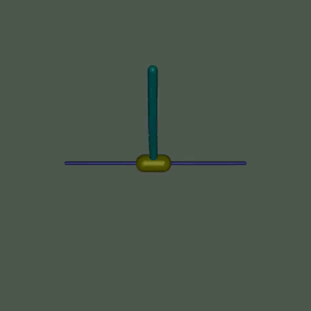

# Proximal Policy Optimization

## Installation

1. Create the conda environment

```bash
conda create -n ppo
conda activate ppo
conda install pip
pip install -r requirements.txt
```

2. Download Mujoco (WARNING: not supported on Windows)

```bash
mkdir ~/.mujoco && wget -qO- https://mujoco.org/download/mujoco210-linux-x86_64.tar.gz | tar xzf - -C ~/.mujoco
```

3. Fix paths
Mujoco path and fix Acme [issue](https://github.com/deepmind/acme/issues/47#issuecomment-661126129). Add to `.bashrc` (or `.profile`) and start a new shell (or login sesssion) (and replace "/path/to/conda/" by your actual path):

```bash
export LD_LIBRARY_PATH=$LD_LIBRARY_PATH:~/.mujoco/mujoco210/bin:/path/to/conda/envs/ppo/lib
```

You may also need to install `patchelf` to build Mujoco.

`sudo apt-get install patchelf`

4. Install the package

```bash
pip install .
```

## Reproduce the results

In the `scripts` folder, you can either execute the `run.py` Python file
or run the bash scripts.

The results are available [here](assets/results).

### InvertedPendulum-v2


### InvertedDoublePendulum-v2



### Reacher-v2


### Walker2d-v3


## Ressources

- [Article on ArXiv](https://arxiv.org/abs/1707.06347)
- [(New) Gym documentation](https://www.gymlibrary.ml)
- [Reacher](https://www.gymlibrary.ml/pages/environments/mujoco/reacher)
- [Inverted Pendulum](https://www.gymlibrary.ml/pages/environments/mujoco/inverted_pendulum)
